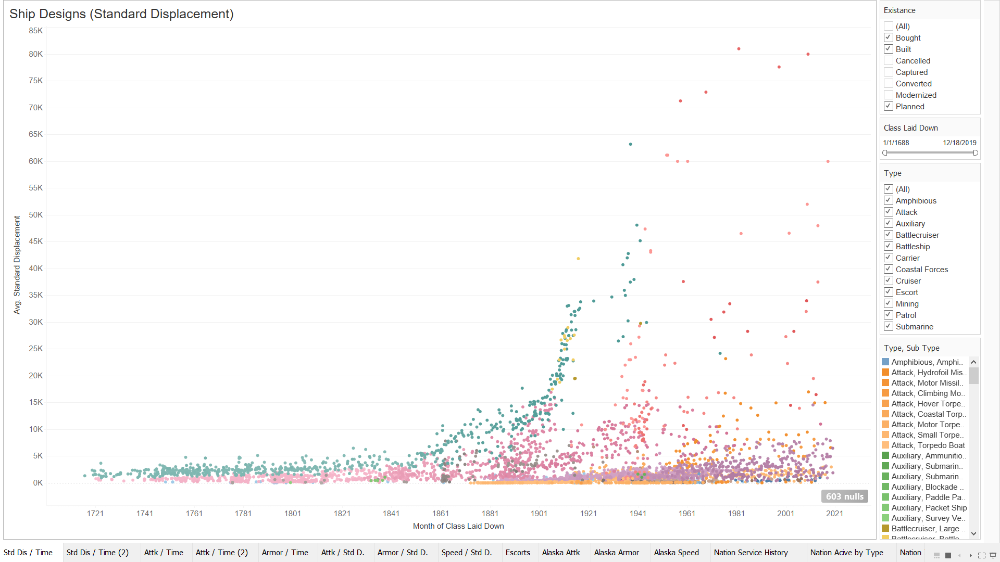
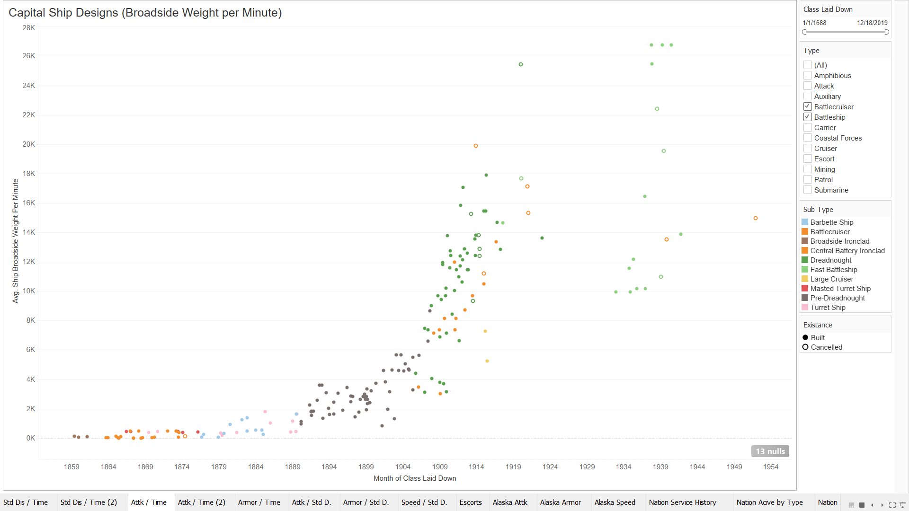
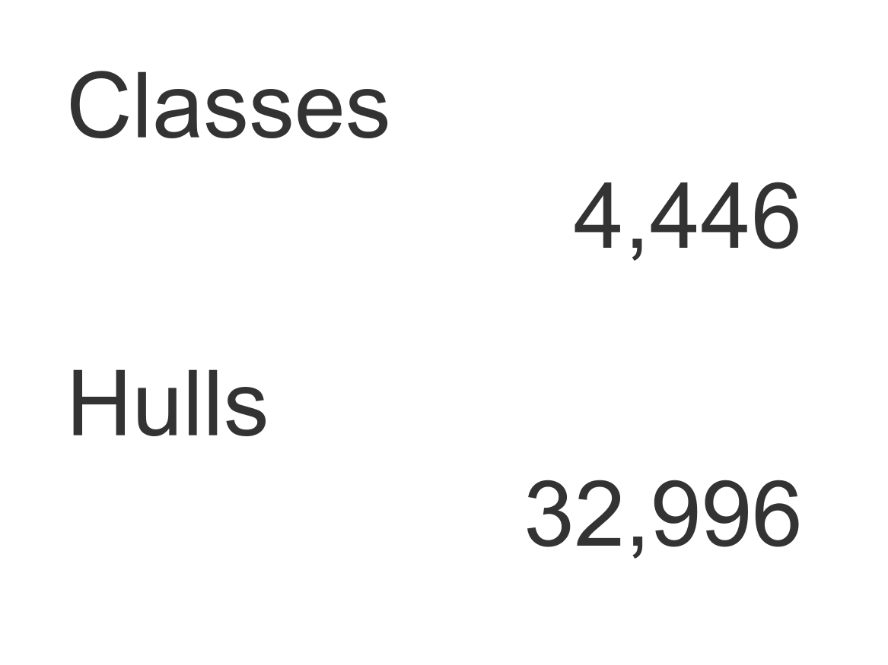

# Viz Showcase

Here is a showcased of what can be visualized by this project.

## The World View

This Viz shows an overview of all ship designs in the database at a glance.  Every mark is a subclass by its standard displacement based on the date that the first hull was laid down.

## A Preview of Firepower Comparisons

This is a preview of the possiblities for comparing the performance characteristics of ship designs.  Here we have many capital ship designs showing their broadside shell weight per minute firepower.

## The Size of the Dataset

Here is a summary of the size of the dataset.

